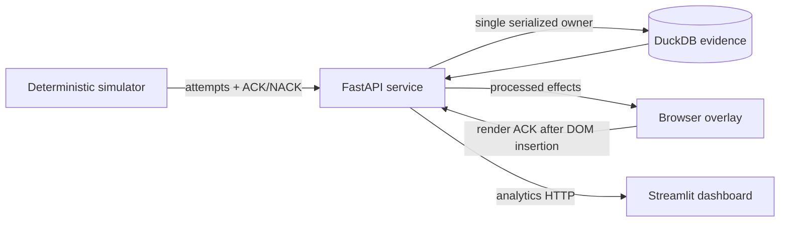

# Stream Reliability Lab

[](https://github.com/Aignle/Stream-Reliability-Lab/actions/workflows/checks.yml)

I built Stream Reliability Lab to answer one question: after retries,
disconnects, and rejected payloads, what actually reached the browser?

It is a local, deterministic test lab for a small real-time event system. The
simulator sends synthetic creator events through FastAPI and WebSockets, the API
records their lifecycle in DuckDB, a browser overlay acknowledges DOM insertion,
and a Streamlit dashboard tells the story from stored evidence.

**Fixed-seed run:** 500 generated → 526 delivery attempts → 10 intentionally
rejected → 490 canonical events → 490 processed → 490 browser render ACKs.

[Run it locally](#run-it) · [Inspect the evidence](#what-happened) ·
[Read the failure case](#failure-case) · [See the validation](#how-i-verified-it)


The v0.1 claim is deliberately narrow: **at-least-once source delivery,
idempotent processing, and effectively-once visible effects within one browser
document**. It does not claim universal exactly-once delivery, production scale,
or a real creator-platform integration.

## What it tests

- A valid event and its delivery attempt commit before the API sends an
  `accepted` reply.
- Duplicate attempts remain auditable but cannot create a second canonical
  event or processing effect.
- One browser document inserts at most one DOM element per `event_id`, including
  across an overlay reconnect, then sends a render ACK that the API records only
  after successful-dispatch evidence.
- Invalid payload rejection stays separate from transport and processing
  failure metrics.
- Accepted but unfinished work is recovered after restart without creating a
  second processing effect.
- Six deterministic scenarios cover happy path, duplicate delivery, invalid
  payloads, delayed and out-of-order delivery, forced reconnect, and the mixed
  `reconnect_burst` demonstration.

## Failure case

The reconnect scenario deliberately creates an ambiguous client view. The API
first commits the event and attempt, then sends an `accepted` reply on the old
WebSocket. The simulator closes that transport before reading the reply. After
reconnecting, it retries the same `event_id`; the API records a duplicate
attempt and returns `duplicate` instead of creating another event or effect.

In the fixed-seed run, the server persisted and accepted 490 unique events while
the simulator observed 489 `accepted` replies. The missing reply is
an unobserved acknowledgment, not event loss: the duplicate response lets the
client reconcile all 490 IDs, and the browser document records one visible
effect for each canonical event.

## What happened

The latest checked measurement used `reconnect_burst`, seed `20250314`, on a
local Windows 11 machine. The scenario is reproducible; the timings below are
one local observation, not a capacity benchmark.

| Stored or client evidence | Result |
| --- | ---: |
| Generated manifest / delivery attempts | 500 / 526 |
| Intentionally rejected attempts | 10 (1.90% of attempts) |
| Canonical events / duplicate attempts | 490 / 26 |
| Server accepted-ACK sends / client-observed accepted replies | 490 / 489 |
| Processed / dispatched / browser render-acknowledged | 490 / 490 / 490 |
| Identity conflicts / operational ingestion failures | 0 / 0 |
| Reconnects / bounded retries | 1 / 1 |
| Persist-to-render p50 / p95 / p99 | 32.969 / 42.926 / 46.847 ms |

The ten rejected attempts were intentionally malformed test inputs. Calling
1.90% a generic “delivery failure rate” would misdescribe the run. The complete
measurement profile and injection plan live in
[SCENARIOS.md](docs/SCENARIOS.md).

## What surprised me

The interesting distinction was not “did an ACK exist?” but “who could prove
they observed it?” The server had durable event evidence and evidence that the
accepted reply was sent; the client still had one fewer accepted reply because
the old connection disappeared before it read that message.

I also found that duplicate delivery and duplicate visible effect are different
problems. Event-ID idempotency protects canonical storage and processing, while
the overlay still needs its own replay deduplication. Likewise, a rejected test
payload is not a transport failure. Keeping those categories separate made the
dashboard less flattering but much more useful.

Finally, dispatch and render are not interchangeable. The API persists a
successful dispatch before it accepts the browser's render ACK; the browser ACK
proves DOM insertion, not physical pixels in OBS.

## How it works



The stack is Python 3.12, FastAPI, Pydantic, DuckDB, Streamlit, vanilla
JavaScript, pytest, Playwright, Docker Compose, and GitHub Actions. FastAPI is
the sole DuckDB owner; the dashboard reads through analytics endpoints rather
than opening the database itself.

## Run it

Requirements: Python 3.12+, a Playwright Chromium binary for browser tests,
Node.js for the optional JavaScript syntax check, and Docker Desktop only for
the container path. No credentials, tokens, real usernames, or private stream
data are needed.

Windows PowerShell:

```powershell
py -3.12 -m venv .venv
.\.venv\Scripts\Activate.ps1
python -m pip install -e ".[dev]"
python -m playwright install chromium
```

macOS or Linux:

```bash
python3.12 -m venv .venv
source .venv/bin/activate
python -m pip install -e ".[dev]"
python -m playwright install chromium
```

Then use three terminals:

```bash
# terminal 1: API and overlay
python -m uvicorn streamlab.main:app --host 127.0.0.1 --port 8000

# terminal 2: analytics dashboard
python -m streamlit run src/streamlab/dashboard.py

# terminal 3: fixed-seed demonstration
python -m streamlab.simulator --scenario reconnect_burst --seed 20250314 --count 500 --rate 1000 --burst-rate 5000 --overlay-wait 120
```

The simulator prints a run-specific overlay URL and waits for that browser
session before sending. Open the printed URL, then inspect the completed run at
<http://127.0.0.1:8501>. Raw API evidence is available from the dashboard's
technical expanders and FastAPI's local docs at <http://127.0.0.1:8000/docs>.
`make run-api`, `make run-dashboard`, and `make demo` are shortcuts.

The default database is `data/streamlab.duckdb`; override it with
`STREAMLAB_DB_PATH`. Local databases are ignored by Git. A separate synthetic
[overlay capture](docs/images/overlay-demo.png) shows the browser surface.

### Docker Compose

```bash
docker compose config --quiet
docker compose up --build --wait
docker compose exec api python -m streamlab.simulator --scenario reconnect_burst --seed 20250314 --count 500 --rate 1000 --burst-rate 5000 --overlay-wait 120
```

The API, overlay, and dashboard use ports 8000, 8000, and 8501 respectively;
DuckDB lives in the named `streamlab-data` volume. `docker compose down` keeps
that evidence. Add `--volumes` only when you intentionally want to delete it.

## How I verified it

The default suite covers unit, integration, WebSocket, analytics, and dashboard
behavior. The marked suites run a real Uvicorn process and Chromium browser;
the scenario test repeats the full path with 500 generated events.

```bash
python -m pytest -q
python -m pytest -m e2e -q
python -m pytest -m scenario -q
python -m ruff check .
python -m ruff format --check .
python -m mypy src
python -m pip check
node --check src/streamlab/static/overlay.js
docker compose config --quiet
```

The Playwright path starts the real API, opens Chromium, runs the simulator,
checks one DOM element per valid `event_id`, verifies invalid IDs are absent,
and polls the API for stored render acknowledgments. GitHub Actions runs these
same proof layers on Python 3.12. `make verify` is the local reviewer-facing
shortcut.

## Tradeoffs

- **DuckDB:** a compact, inspectable local evidence store that fits the demo.
  Serializing access through the API avoids unsafe multi-process ownership, but
  this is not a horizontally scalable database design.
- **Streamlit:** made it practical to expose stored evidence without building a
  frontend framework. The tradeoff is less control over layout and interaction;
  keeping it API-only preserves the important boundary.
- **Production:** I would separate durable processing from the API, use a store
  designed for multiple workers, and add authentication, observability, and
  network-level fault injection. Those changes would obscure the v0.1 learning
  goal, so they remain out of scope.

## Honest limitations

- This is a single-process local lab with one serialized DuckDB writer.
- Synchronous DuckDB work can briefly occupy the API event loop during larger
  manifest writes; the 500-event run proves only this demonstration size.
- Startup recovery handles persisted-but-unprocessed work, but there is no
  separate durable worker or always-on retry queue.
- Forced disconnects and delays are deterministic simulator faults corroborated
  by stored evidence, not packet-level network faults.
- A browser render ACK proves DOM insertion in that browser session, not
  physical pixels in OBS or a capture device.
- Dependency ranges are bounded, but the pip/setuptools workflow has no
  cross-platform lockfile; CI and Docker validate fresh installs within those
  bounds.

## Technical notes

- [Architecture](docs/ARCHITECTURE.md)
- [Event contract](docs/EVENT_CONTRACT.md)
- [Reliability model](docs/RELIABILITY_MODEL.md)
- [Scenario definitions and full fixed-run evidence](docs/SCENARIOS.md)
- [Testing strategy](docs/TESTING.md)
- [Product boundary](SPEC.md) and [implementation plan](PLAN.md)
- [Recorded decisions](DECISIONS.md) and [progress evidence](PROGRESS.md)

Built by David Wigton as a portfolio project exploring QA automation, real-time event systems, and reliability analytics.
