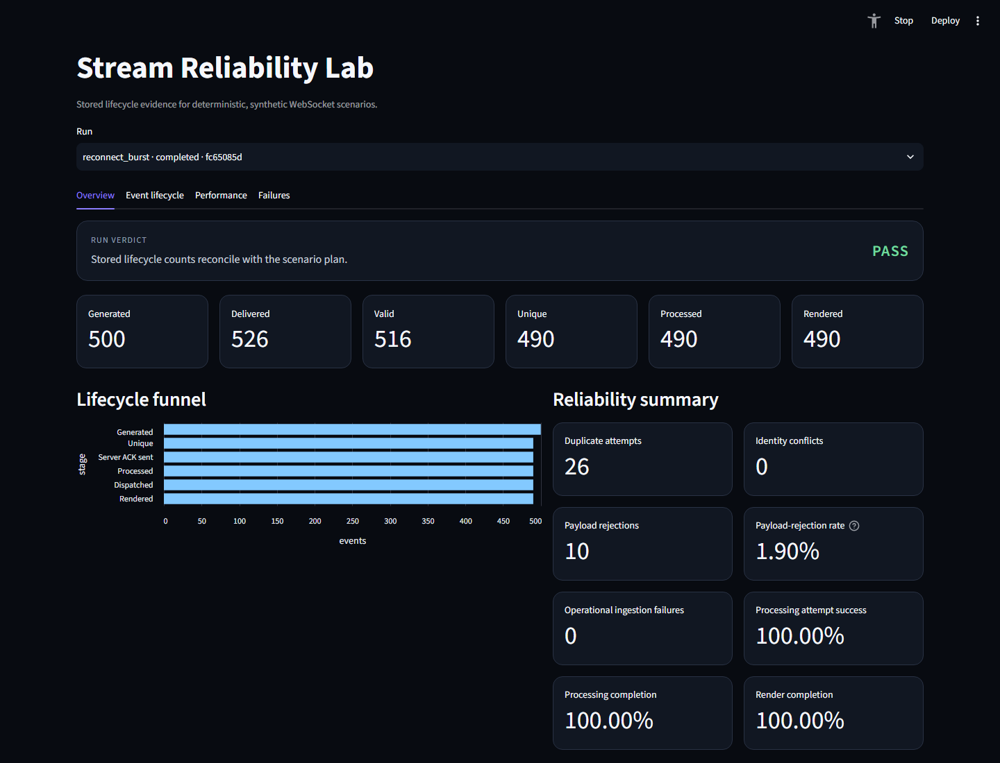
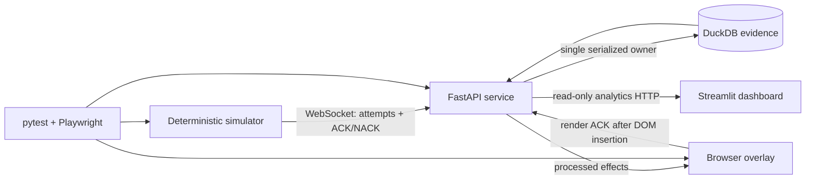
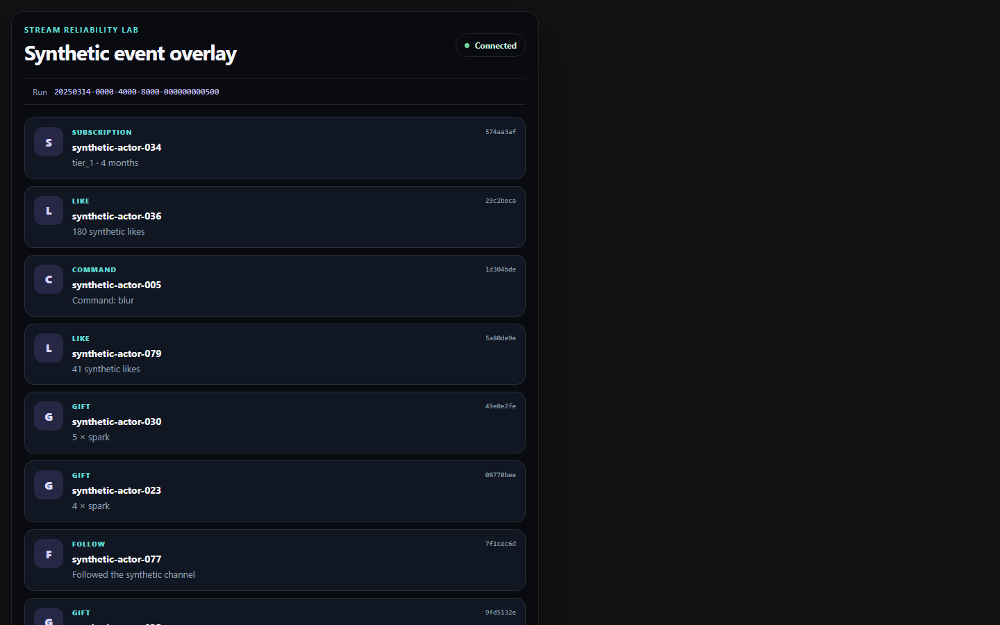

# Stream Reliability Lab

Stream Reliability Lab is a local reliability-testing and analytics platform
for a small real-time event system. It generates deterministic synthetic
creator events, injects delivery and connection faults, persists every observed
attempt in DuckDB, renders idempotent effects in a browser overlay, and reports
what actually reached each lifecycle stage.

The v0.1 claim is deliberately narrow: **at-least-once source delivery with
idempotent processing and browser effects**. It does not claim universal
exactly-once delivery, production scale, or real platform integration.



## What is proved

- Six strict, typed event families: comments, follows, gifts, likes,
  subscriptions, and commands.
- Six deterministic scenarios: `happy_path`, `duplicate_delivery`,
  `invalid_payloads`, `delayed_out_of_order`, `forced_reconnect`, and
  `reconnect_burst`.
- A valid unique event and its delivery attempt commit before an accepted ACK
  is sent.
- Duplicate attempts remain visible as evidence but create one canonical event,
  one successful processing effect, and one DOM element per browser session.
- Invalid inputs receive structured NACKs, remain auditable, and never become
  overlay effects.
- Every ingestion socket is bound to one registered run, so malformed
  cross-run payloads cannot contaminate another run's evidence.
- Delayed scenarios persist a server-stamped marker before each hold and derive
  the observed lower-bound duration from that marker to the first matching
  delivery attempt; a delay counts only when it meets the configured hold.
- The forced reconnect proves an accepted reply was sent for the persisted
  target on the old transport, deliberately not observed by the client, and
  retried as a duplicate on the distinct reconnected transport.
- The browser sends a render acknowledgment only after inserting an element
  carrying `data-event-id`; the API stores that acknowledgment.
- Streamlit reads analytics through FastAPI only. FastAPI is the sole DuckDB
  owner and writer.

## Architecture



The service keeps network connections in memory but derives replay and metrics
from durable evidence. See [architecture](docs/ARCHITECTURE.md), the
[event contract](docs/EVENT_CONTRACT.md), and the
[reliability model](docs/RELIABILITY_MODEL.md).

## Requirements

- Python 3.12 or newer
- Node.js only for the optional `node --check` JavaScript syntax command
- A Playwright Chromium binary for browser tests
- Docker Desktop with Compose for the container path
- GNU Make is optional; every target is shown as a Python command below

No credentials, tokens, real usernames, or private stream data are required.

## Local setup

Windows PowerShell:

```powershell
py -3.12 -m venv .venv
.\.venv\Scripts\Activate.ps1
python -m pip install -e ".[dev]"
python -m playwright install chromium
```

macOS or Linux:

```bash
python3.12 -m venv .venv
source .venv/bin/activate
python -m pip install -e ".[dev]"
python -m playwright install chromium
```

The default database is `data/streamlab.duckdb`. Override it with
`STREAMLAB_DB_PATH`; local databases are ignored by Git.

## Quick start

1. Start the API in terminal one:

   ```bash
   python -m uvicorn streamlab.main:app --host 127.0.0.1 --port 8000
   ```

2. Start the dashboard in terminal two:

   ```bash
   python -m streamlit run src/streamlab/dashboard.py
   ```

3. Start the fixed-seed demonstration in terminal three:

   ```bash
   python -m streamlab.simulator --scenario reconnect_burst --seed 20250314 --count 500 --rate 1000 --burst-rate 5000 --overlay-wait 120
   ```

4. The simulator prints a run-specific overlay URL and waits. Open that local
   URL before the 120-second timeout. Delivery starts once the browser session
   is stored.

5. Open <http://127.0.0.1:8501> and select the completed run. The overlay is
   also available at <http://127.0.0.1:8000/overlay>; without an explicit run it
   selects the latest run.

`make run-api`, `make run-dashboard`, and `make demo` are equivalent shortcuts.

## Smaller scenario commands

```bash
python -m streamlab.simulator --scenario happy_path --seed 42 --count 20 --rate 50
python -m streamlab.simulator --scenario duplicate_delivery --seed 42 --count 30 --rate 100
python -m streamlab.simulator --scenario invalid_payloads --seed 42 --count 12 --rate 100
python -m streamlab.simulator --scenario delayed_out_of_order --seed 42 --count 30 --rate 100
python -m streamlab.simulator --scenario forced_reconnect --seed 42 --count 30 --rate 100
```

A run without a connected overlay can still prove ingestion and processing,
but its dashboard verdict is honestly `incomplete` because no browser render
evidence exists. Scenario details are in [SCENARIOS.md](docs/SCENARIOS.md).

## Validation

Core unit, integration, WebSocket, and dashboard checks:

```bash
python -m pytest
python -m ruff check .
python -m ruff format --check .
python -m mypy src
python -m pip check
node --check src/streamlab/static/overlay.js
```

Real browser and 500-event proofs are explicit markers so a clean core test run
does not silently require a downloaded browser:

```bash
python -m pytest -m e2e
python -m pytest -m scenario
```

`make verify` runs the core/static checks, both browser-heavy markers, and
Compose configuration validation as one reviewer-facing gate.

The Playwright vertical test starts real Uvicorn, opens real Chromium, runs the
simulator, checks one DOM element per valid `event_id`, checks invalid IDs are
absent, and polls the API for stored render acknowledgments. The scenario test
repeats that proof with 500 generated events. See the full
[testing strategy](docs/TESTING.md).

## Docker Compose

Build and start the API and dashboard:

```bash
docker compose config --quiet
docker compose up --build --wait
```

The API is at <http://127.0.0.1:8000>, the overlay at
<http://127.0.0.1:8000/overlay>, and Streamlit at
<http://127.0.0.1:8501>. DuckDB lives in the named `streamlab-data` volume.
If port 8501 is already reserved, set `STREAMLAB_DASHBOARD_PORT` before `up`
(for example `$env:STREAMLAB_DASHBOARD_PORT=8502` in PowerShell) and use that
host port instead. The container still listens on 8501.

Run a scenario inside the API container:

```bash
docker compose exec api python -m streamlab.simulator --scenario reconnect_burst --seed 20250314 --count 500 --rate 1000 --burst-rate 5000 --overlay-wait 120
```

Stop services while retaining evidence with `docker compose down`; add
`--volumes` only when you intentionally want to delete the local demo database.

## Measured fixed-seed demonstration

Measured on 2026-07-14 on Windows 11 Home 10.0.22631 x64, Intel Core
i9-14900K (24 cores / 32 logical processors), Python 3.12.5, and Playwright
Chromium 149.0.7827.55. This is one local observation, not a capacity claim.

| Evidence | Measured value |
| --- | ---: |
| Scenario / seed | `reconnect_burst` / `20250314` |
| Configured rates | 1,000 events/s normal; 5,000 events/s burst |
| Generated manifest | 500 |
| Delivery attempts | 526 |
| Valid deliveries | 516 |
| Unique persisted / server ACK sends / processed | 490 / 490 / 490 |
| Dispatched / browser render-acknowledged | 490 / 490 |
| Duplicate attempts | 26 (25 planned + 1 reconnect retry) |
| Client-observed accepted / duplicate replies | 489 / 26 |
| Payload-rejected delivery attempts / rate | 10 / 1.90% of 526 attempts |
| Conflicts / unrendered | 0 / 0 |
| Reconnects / client retries | 1 / 1 |
| Correlated reconnect target | Old reply sent but not observed; retry duplicate |
| Planned / observed delay injections | 5 / 5 |
| Reconnect duration | 14.109 ms |
| Persist-to-render p50 / p95 / p99 | 28.197 / 38.658 / 45.781 ms |
| Latency sample count | 490 |
| Stored run duration | 13.337 s |
| Final verdict | `pass` |

The reconnect counts intentionally use two viewpoints. The server persisted and
accepted 490 unique events, while the simulator observed 489 `accepted` replies.
The accepted reply for the reconnect target was sent on the old transport but
was not read before that transport closed. Its retry returned `duplicate`, so
the client still reconciled 490 unique IDs and all 490 events were processed and
rendered exactly once. No unique event or visible effect was lost.

Runtime client results and DuckDB evidence are generated locally and
intentionally ignored by Git. The checked-in screenshots show the same
fixed-seed scenario's overlay and dashboard surfaces:



## Analytics API

- `GET /health`
- `POST /api/runs`
- `POST /api/runs/{run_id}/complete`
- `GET /api/runs`
- `GET /api/runs/{run_id}/overview`
- `GET /api/runs/{run_id}/events`
- `GET /api/runs/{run_id}/events/{event_id}`
- `GET /api/runs/{run_id}/performance`
- `GET /api/runs/{run_id}/failures`
- `WS /ws/ingest?run_id={run_id}`
- `WS /ws/overlay`

FastAPI also exposes local interactive schema documentation at
<http://127.0.0.1:8000/docs>.

## Honest limitations

- This is a single-process local lab with one serialized DuckDB writer, not a
  horizontally scaled service.
- Synchronous DuckDB calls can briefly occupy the API event loop during large
  manifest writes; the 500-event run is evidence for this demo size only.
- Startup recovery processes every persisted-but-unprocessed event. There is
  no separate durable worker or always-on background retry queue.
- Forced disconnects and delivery delays are client-controlled and corroborated
  by stored simulator/server evidence; they are not packet-level network faults.
- The reported 1.90% is a payload-rejection rate for ten intentionally invalid
  deliveries. v0.1 does not derive a generic transport delivery-failure rate.
- A browser acknowledgment proves DOM insertion, not physical pixels in OBS or
  a capture device.
- The deterministic logical `occurred_at` timestamps are not used for runtime
  latency. Runtime metrics use persisted evidence timestamps.
- Dependency ranges are bounded but the project does not yet maintain a lock
  file for byte-for-byte environment reproduction.

## Documentation

- [SPEC.md](SPEC.md) - product boundary and acceptance criteria
- [PLAN.md](PLAN.md) - implementation plan and quality priorities
- [Architecture](docs/ARCHITECTURE.md)
- [Event contract](docs/EVENT_CONTRACT.md)
- [Reliability model](docs/RELIABILITY_MODEL.md)
- [Scenarios](docs/SCENARIOS.md)
- [Testing strategy](docs/TESTING.md)
- [DECISIONS.md](DECISIONS.md) - recorded implementation tradeoffs
- [PROGRESS.md](PROGRESS.md) - checkpoint evidence
